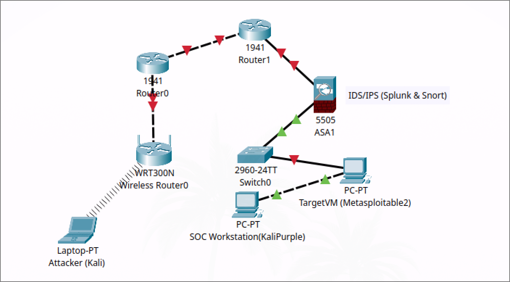

# SOC Architecture & Infrastructure

## Network Topology

## NIST CSF Domains & Kali Purple Tools Integration

This section maps the NIST Cybersecurity Framework (CSF) domains to specific tools available in Kali Purple that support SOC operations.

### 1. IDENTIFY (ID)
*Develop organizational understanding to manage cybersecurity risk to systems, assets, data, and capabilities.*

#### Asset Management (ID.AM)
- **Network Discovery Tools**
  - `nmap`, `rustscan`, `masscan`, `amap`
- **Network Mapping**
  - `zenmap` (Nmap GUI), `automapper`

#### Vulnerability Management (ID.VM)
- **Vulnerability Scanners**
  - `nessus`, `openvas` (Greenbone Vulnerability Manager)
  - `nikto` (web vulnerability scanner)
  - `wpscan` (WordPress scanner)
  - Nmap vulnerability detection scripts

#### Risk Assessment (ID.RA)
- **Frameworks & Methodologies**
  - NIST CSF implementation
  - MITRE ATT&CK framework integration
- **Configuration Assessment**
  - `lynis` (security auditing and hardening)
  - `cve-search` (CVE database queries)

#### Threat Intelligence (ID.TI)
- **OSINT Tools**
  - `theharvester`, `metagoofil`, `recon-ng`, `spiderfoot`
- **External Integration**
  - MISP (Malware Information Sharing Platform) connectivity

### 2. PROTECT (PR)
*Implement appropriate safeguards to ensure delivery of critical services.*

#### Identity Management and Access Control (PR.AC)
- **Authentication Testing**
  - `john`, `hashcat` (password policy validation)
  - `hydra`, `medusa` (authentication testing)

#### Data Security (PR.DS)
- **Encryption Utilities**
  - `gpg`, `openssl`

#### Protective Technology (PR.PT)
- **Firewall Management**
  - `nmap` (firewall testing)
  - `iptables`, `nftables` (firewall configuration)
- **Intrusion Prevention**
  - `Suricata`, `Zeek` (configurable for prevention)
- **Endpoint Security Testing**
  - Metasploit framework (evasion testing)

### 3. DETECT (DE)
*Implement appropriate activities to identify cybersecurity events.*

#### Anomalies and Events Detection (DE.AE)
- **Intrusion Detection Systems**
  - `Suricata`, `Zeek` (network monitoring)
- **Log Analysis**
  - Command-line utilities: `grep`, `awk`, `sed`
  - Python/Bash scripting for log parsing
  - ELK Stack/Graylog integration

#### Security Continuous Monitoring (DE.CM)
- **Network Monitoring**
  - `wireshark`, `tcpdump`, `tshark`, `ntopng`
- **System Monitoring**
  - Standard Linux monitoring tools
  - Integration with external monitoring platforms

### 4. RESPOND (RS)
*Develop appropriate activities to take action on detected incidents.*

#### Analysis (RS.AN)
- **Digital Forensics**
  - `Autopsy`, `bulk_extractor`, `strings`, `binwalk`
  - `Volatility` (memory forensics)
- **Malware Analysis**
  - `radare2`, `ltrace`, `strace`
- **Network Forensics**
  - `Wireshark`, `tshark` (packet analysis)

#### Mitigation (RS.MI)
- **Containment Strategy Testing**
- **Response Automation**
  - Custom scripting for response actions

### 5. RECOVER (RC)
*Implement activities to maintain resilience and restore impaired services.*

- **Recovery Planning**  
- **Improvement Processes**
- **Communication Strategies**

## Lab Environment

This SOC lab leverages Kali Purple as the foundation for security operations, providing a comprehensive set of tools spanning the entire NIST CSF. The environment consists of segmented networks for monitoring, analysis, and testing, with proper isolation of vulnerable systems.
